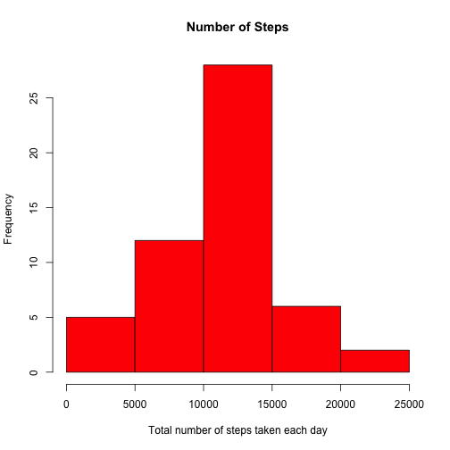

# Reproducible Research: Peer Assessment 1

### Written By: Zammi Kahan


## Loading and preprocessing the data

```r
data <- read.csv("activity.csv", header=TRUE)
data$date <- as.Date(data$date, "%Y-%m-%d")
str(data)
```

```
## 'data.frame':	17568 obs. of  3 variables:
##  $ steps   : int  NA NA NA NA NA NA NA NA NA NA ...
##  $ date    : Date, format: "2012-10-01" "2012-10-01" ...
##  $ interval: int  0 5 10 15 20 25 30 35 40 45 ...
```

## What is mean total number of steps taken per day?

```r
library(plyr)
total_per_day <- ddply(data[!is.na(data$steps),], .(date), summarise, steps=sum(steps))
with(total_per_day, hist(
        total_per_day$steps,
        col = "red",
        xlab = "Total number of steps taken each day",
        ylab = "Frequency",
        main = "Number of Steps"
)
) 
```

 

```r
original_mean <-mean(total_per_day$steps)
original_median <- median(total_per_day$steps)

## Mean of total steps per day
original_mean
```

```
## [1] 10766
```

```r
## Median of total steps per day
original_median
```

```
## [1] 10765
```

## What is the average daily activity pattern?

```r
average_per_interval <- ddply(data[!is.na(data$steps),], .(interval), summarise, steps=mean(steps))
colnames(average_per_interval)[2] <- "average"
with(average_per_interval, {
        plot(average_per_interval$interval, average_per_interval$average, type="l", 
             col="blue",
             xlab="5-minute interval", 
             ylab="Average number of steps taken",
             main="Average daily activity pattern")
}
)
```

 

```r
# Which 5-minute interval, on average across all the days in the dataset, contains the maximum number of steps?
average_per_interval[average_per_interval$average==max(average_per_interval$average),]
```

```
##     interval average
## 104      835   206.2
```

## Imputing missing values


```r
# Total number of missing values in the dataset
sum(is.na(data$steps))
```

```
## [1] 2304
```

```r
# Fill NA's with average for that 5-min interval
filled_data <- arrange(join(data, average_per_interval), interval)
```

```
## Joining by: interval
```

```r
filled_data$average <- round(filled_data$average)

# Create a new dataset that is equal to the original dataset but with the missing data filled in.
filled_data$steps[is.na(filled_data$steps)] <- filled_data$average[is.na(filled_data$steps)]
new_data <- filled_data[, c("steps", "date", "interval")]
rm(filled_data)

# Histogram
new_total_per_day <- ddply(new_data, .(date), summarise, steps=sum(steps))
with(new_total_per_day, hist(
        new_total_per_day$steps,
        col = "red",
        xlab = "Total number of steps taken each day",
        ylab = "Frequency",
        main = "Number of Steps"
)
) 
```

 

```r
# mean and median total number of steps taken per day
new_mean <- mean(new_total_per_day$steps)
new_median <- median(new_total_per_day$steps)

## Mean of total steps per day
new_mean
```

```
## [1] 10766
```

```r
## Median of total steps per day
new_median
```

```
## [1] 10762
```

```r
difference_in_mean <- new_mean -original_mean
difference_in_mean
```

```
## [1] -0.5493
```

There is a slight different in the mean values between the original dataset and the new dataset, because I decided to round the values imputed for missing (NA) values. Otherwise mean should not change, because I'm taking the mean by interval and same values used to impute the NA values.

## Are there differences in activity patterns between weekdays and weekends?


```r
library(lattice)
new_data$weekday <- ifelse(weekdays(new_data$date) %in% c("Saturday", "Sunday"),"Weekend", "Weekday")
average_per_interval_weekday <- ddply(new_data, .(interval, weekday), summarise, steps=mean(steps))

xyplot(steps ~ interval | weekday, data = average_per_interval_weekday, layout = c(1, 2), type="l")
```

 
