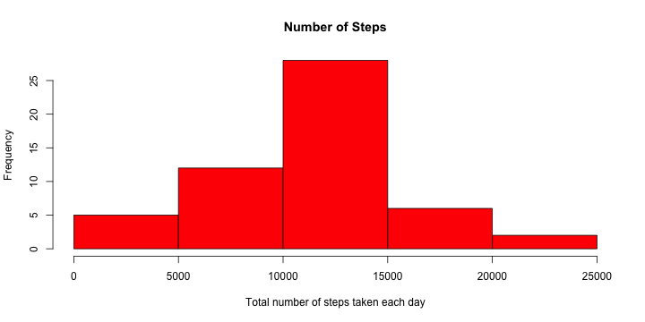
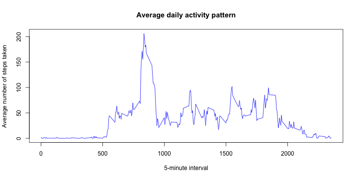
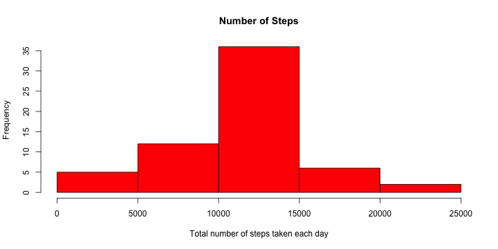
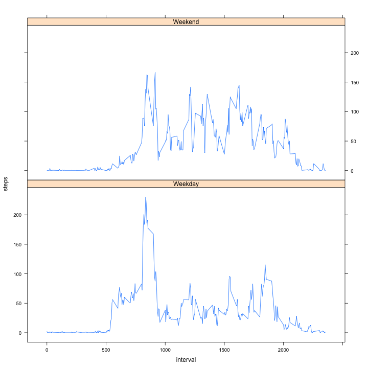

Reproducible Research: Peer Assessment 1
==========================================
Submitted By: Zammi Kahan
 
    
### Data used for the analysis

The data for this assignment can be downloaded from the course web site.  
Dataset: Activity monitoring data [52K]

The variables included in this dataset are:
- **steps**: Number of steps taking in a 5-minute interval (missing values are coded as NA)
- **date**: The date on which the measurement was taken in YYYY-MM-DD format
- **interval**: Identifier for the 5-minute interval in which measurement was taken

The dataset is stored in a comma-separated-value (CSV) file and there are a total of 17,568 observations in this dataset.


### Loading and preprocessing the data
Assumption: We have set the current directory as the working directory and activity.csv file already exists in the current directory.

```r
## Read the activity.csv file file from the current directory
data <- read.csv("activity.csv", header=TRUE)
## Convert date field to Date data type, so that it will be useful for Date calculations.
data$date <- as.Date(data$date, "%Y-%m-%d")
## Print the structure of the dataset loaded. This gives an idea of the data available for analysis.
str(data)
```

```
## 'data.frame':	17568 obs. of  3 variables:
##  $ steps   : int  NA NA NA NA NA NA NA NA NA NA ...
##  $ date    : Date, format: "2012-10-01" "2012-10-01" ...
##  $ interval: int  0 5 10 15 20 25 30 35 40 45 ...
```


### What is mean total number of steps taken per day?
Assumption: For this part of the assignment, we ignore the missing values in the dataset.

```r
## Here we use ddply function on the dataset to generate a new dataset for the total number of steps taken per day. is.na function is used to filter out the NA values.
library(plyr)
total_per_day <- ddply(data[!is.na(data$steps),], .(date), summarise, steps=sum(steps))
```
  
**Plot the histogram of the total number of steps taken each day**

```r
## Dataset for the total number of steps taken per day created above is used to plot the histogram here.
with(total_per_day, hist(
                        total_per_day$steps,
                        col = "red",
                        xlab = "Total number of steps taken each day",
                        ylab = "Frequency",
                        main = "Number of Steps"
                        ) ) 
```

 
  
**Calculate and report the mean and median total number of steps taken per day**

```r
## Dataset for the total number of steps taken per day created above is used to calculate the mean and median values for the total steps per day.
original_mean <- round(mean(total_per_day$steps))
original_median <- round(median(total_per_day$steps))
```
**Mean** of total steps per day is: **1.0766 &times; 10<sup>4</sup>** and **Median** of total steps per day is: **1.0765 &times; 10<sup>4</sup>**.


### What is the average daily activity pattern?

```r
## Here we use ddply function on the dataset to generate a new dataset for the average number of steps taken by interval. is.na function is used to filter out the NA values. Mean function used to calculate the average, and we also rename steps field to "average".
library(plyr)
average_per_interval <- ddply(data[!is.na(data$steps),], .(interval), summarise, steps=mean(steps))
colnames(average_per_interval)[2] <- "average"
```
  
**Make a time series plot (i.e. type = "l") of the 5-minute interval (x-axis) and the average number of steps taken, averaged across all days (y-axis)**

```r
## Here we use the dataset created above for the average number of steps taken by interval to plot the graph. 5-minute interval used for x-axis, and average calculated used for the y-axis.
with (average_per_interval, { plot(average_per_interval$interval, average_per_interval$average, type="l", 
                                        col="blue",
                                        xlab="5-minute interval", 
                                        ylab="Average number of steps taken",
                                        main="Average daily activity pattern")
                                } )
```

 
  
**Which 5-minute interval, on average across all the days in the dataset, contains the maximum number of steps?**

```r
## Here we return the interval related to the peak (maximum) average value.
average_per_interval[average_per_interval$average==max(average_per_interval$average),]
```

```
##     interval average
## 104      835   206.2
```


### Imputing missing values
  
**Calculate and report the total number of missing values in the dataset (i.e. the total number of rows with NAs)**

```r
sum(is.na(data$steps))
```

```
## [1] 2304
```
  
**Devise a strategy for filling in all of the missing values in the dataset. The strategy does not need to be sophisticated. For example, you could use the mean/median for that day, or the mean for that 5-minute interval, etc.**

```r
## For this purpose, we join the average_per_interval dataset we generated abovewith the original dataset and (join by interval) and arrange by interval. This helps us to distribute the mean(average) values of the intervals accross the days. These values can be used to substitute the NA values of the steps where available.
filled_data <- arrange(join(data, average_per_interval), interval)
```

```
## Joining by: interval
```
  
**Create a new dataset that is equal to the original dataset but with the missing data filled in.**

```r
## We use the filled_data dataset created above to generate a new dataset with NA values in the "steps"" field replaced by corresponding "average" values.
filled_data$steps[is.na(filled_data$steps)] <- filled_data$average[is.na(filled_data$steps)]
new_data <- filled_data[, c("steps", "date", "interval")]
## Remove the datasets no more used for the analysis.
rm(filled_data)
```
  
**Make a histogram of the total number of steps taken each day and Calculate and report the mean and median total number of steps taken per day. Do these values differ from the estimates from the first part of the assignment? What is the impact of imputing missing data on the estimates of the total daily number of steps?**

```r
## Here we use ddply function on the dataset to generate a new dataset for the total number of steps taken per day using the new dataset generated above.
library(plyr)
new_total_per_day <- ddply(new_data, .(date), summarise, steps=sum(steps))
```

```r
## new_total_per_day dataset is used to create a histogram for "total number of steps taken each day"
with (new_total_per_day, hist(
                                new_total_per_day$steps,
                                col  = "red",
                                xlab = "Total number of steps taken each day",
                                ylab = "Frequency",
                                main = "Number of Steps"
                                ) ) 
```

 
  
**Mean and median total number of steps taken per day**

```r
## Mean and median are calculated with new_total_per_day dataset.
new_mean <- mean(new_total_per_day$steps)
new_median <- median(new_total_per_day$steps)
```
  
In the new dataset: **mean** of total steps per day is: **1.0766 &times; 10<sup>4</sup>** and the **median** of total steps per day is: **1.0766 &times; 10<sup>4</sup>**. And in the original dataset: **mean** of total steps per day was: **1.0766 &times; 10<sup>4</sup>** and **median** of total steps per day was: **1.0765 &times; 10<sup>4</sup>**.  
  
Therefore, there is no difference in the mean values between the original dataset and the new dataset. This is because I'm using the mean of the intervals of the dataset itself for the imputation of NA values.
Also histogram has more frequency as now we have included the subsitutes for NA values.
  
  
### Are there differences in activity patterns between weekdays and weekends?
  
**Create a new factor variable in the dataset with two levels – “weekday” and “weekend” indicating whether a given date is a weekday or weekend day.**

```r
## Date field is used to identify the weekdays and weekends. New dataset is generated to get the averages of steps by interval by weekday/weekend.
new_data$weekday <- ifelse(weekdays(new_data$date) %in% c("Saturday", "Sunday"),"Weekend", "Weekday")
average_per_interval_weekday <- ddply(new_data, .(interval, weekday), summarise, steps=mean(steps))
```
  
**Make a panel plot containing a time series plot (i.e. type = "l") of the 5-minute interval (x-axis) and the average number of steps taken, averaged across all weekday days or weekend days (y-axis). The plot should look something like the following, which was creating using simulated data:**

```r
## Here we use lattice package to generate a xyplot.
library(lattice)
xyplot(steps ~ interval | weekday, data = average_per_interval_weekday, layout = c(1, 2), type="l")
```

 
