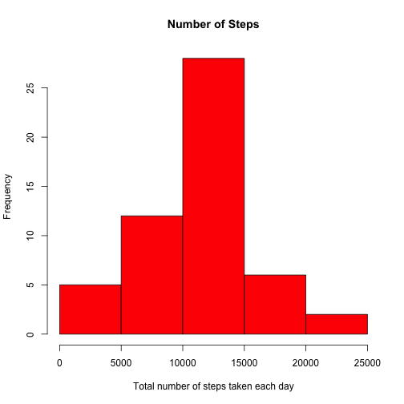
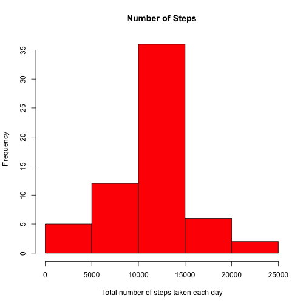
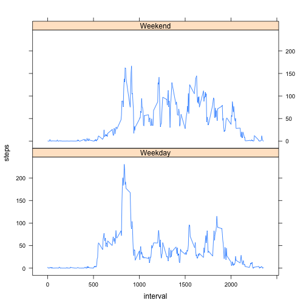

Reproducible Research: Peer Assessment 1
==========================================

Submitted By: Zammi Kahan


### Load the packages used in this analysis

```r
## We use plyr and lattice packages for the analysis
library(plyr)
library(lattice)
```

### Loading and preprocessing the data

```r
## In this section we read and pre-process the data
## Also assume that we have set the current directory as the working directory.
## And activity.csv file already existed in the current directory.

## Read the activity.csv file
data <- read.csv("activity.csv", header=TRUE)
## Convert date field to Date data type
data$date <- as.Date(data$date, "%Y-%m-%d")
## Print the structure of the data set loaded for the analysis
str(data)
```

```
## 'data.frame':	17568 obs. of  3 variables:
##  $ steps   : int  NA NA NA NA NA NA NA NA NA NA ...
##  $ date    : Date, format: "2012-10-01" "2012-10-01" ...
##  $ interval: int  0 5 10 15 20 25 30 35 40 45 ...
```

### What is mean total number of steps taken per day?

```r
## Assumption: For this part of the assignment, we ignore the missing values in the dataset.

## Here we apply plyr package / ddply to calculate the total number of steps taken per day dataset
total_per_day <- ddply(data[!is.na(data$steps),], .(date), summarise, steps=sum(steps))

## 1. Make a histogram of the total number of steps taken each day
with(total_per_day, hist(
        total_per_day$steps,
        col = "red",
        xlab = "Total number of steps taken each day",
        ylab = "Frequency",
        main = "Number of Steps"
)
) 
```

 

```r
## 2. Calculate and report the mean and median total number of steps taken per day
original_mean <-mean(total_per_day$steps)
original_median <- median(total_per_day$steps)

## Mean of total steps per day
original_mean
```

```
## [1] 10766
```

```r
## Median of total steps per day
original_median
```

```
## [1] 10765
```

### What is the average daily activity pattern?

```r
## Here we apply plyr package / ddply to calculate the average daily activity pattern dataset
average_per_interval <- ddply(data[!is.na(data$steps),], .(interval), summarise, steps=mean(steps))
colnames(average_per_interval)[2] <- "average"

## 1. Make a time series plot (i.e. type = "l") of the 5-minute interval (x-axis) and the average number of steps taken, averaged across all days (y-axis)
with(average_per_interval, {
        plot(average_per_interval$interval, average_per_interval$average, type="l", 
             col="blue",
             xlab="5-minute interval", 
             ylab="Average number of steps taken",
             main="Average daily activity pattern")
}
)
```

 

```r
# 2. Which 5-minute interval, on average across all the days in the dataset, contains the maximum number of steps?
average_per_interval[average_per_interval$average==max(average_per_interval$average),]
```

```
##     interval average
## 104      835   206.2
```

### Imputing missing values


```r
## 1. Calculate and report the total number of missing values in the dataset (i.e. the total number of rows with NAs)
sum(is.na(data$steps))
```

```
## [1] 2304
```

```r
## 2. Devise a strategy for filling in all of the missing values in the dataset. The strategy does not need to be sophisticated. For example, you could use the mean/median for that day, or the mean for that 5-minute interval, etc.

## For this purpose, we use the average_per_interval dataset we generated above. average_per_interval is joined to the original dataset and arrange by interval. Also round the mean/average values.
filled_data <- arrange(join(data, average_per_interval), interval)
```

```
## Joining by: interval
```

```r
filled_data$average <- round(filled_data$average)

## 3. Create a new dataset that is equal to the original dataset but with the missing data filled in.
## We use the joined dataset above to create a new dataset with NA values filled in steps field
filled_data$steps[is.na(filled_data$steps)] <- filled_data$average[is.na(filled_data$steps)]
new_data <- filled_data[, c("steps", "date", "interval")]
rm(filled_data)

## 4. Make a histogram of the total number of steps taken each day and Calculate and report the mean and median total number of steps taken per day. Do these values differ from the estimates from the first part of the assignment? What is the impact of imputing missing data on the estimates of the total daily number of steps?
new_total_per_day <- ddply(new_data, .(date), summarise, steps=sum(steps))
with(new_total_per_day, hist(
        new_total_per_day$steps,
        col = "red",
        xlab = "Total number of steps taken each day",
        ylab = "Frequency",
        main = "Number of Steps"
)
) 
```

 

```r
# mean and median total number of steps taken per day
new_mean <- mean(new_total_per_day$steps)
new_median <- median(new_total_per_day$steps)

## Mean of total steps per day
new_mean
```

```
## [1] 10766
```

```r
## Median of total steps per day
new_median
```

```
## [1] 10762
```

```r
## Difference of mean in the new dataset and the original dataset
difference_in_mean <- new_mean -original_mean
difference_in_mean
```

```
## [1] -0.5493
```

There is a slight different in the mean values between the original dataset and the new dataset, because I decided to round the values imputed for missing (NA) values. Otherwise mean should not change, because I'm taking the mean by interval and same values used to impute the NA values.
Also histogram has more frequency as now we have included the subsitutes for NA values.

### Are there differences in activity patterns between weekdays and weekends?


```r
## 1. Create a new factor variable in the dataset with two levels – “weekday” and “weekend” indicating whether a given date is a weekday or weekend day.
new_data$weekday <- ifelse(weekdays(new_data$date) %in% c("Saturday", "Sunday"),"Weekend", "Weekday")
average_per_interval_weekday <- ddply(new_data, .(interval, weekday), summarise, steps=mean(steps))

## 2. Make a panel plot containing a time series plot (i.e. type = "l") of the 5-minute interval (x-axis) and the average number of steps taken, averaged across all weekday days or weekend days (y-axis). The plot should look something like the following, which was creating using simulated data:
xyplot(steps ~ interval | weekday, data = average_per_interval_weekday, layout = c(1, 2), type="l")
```

 
